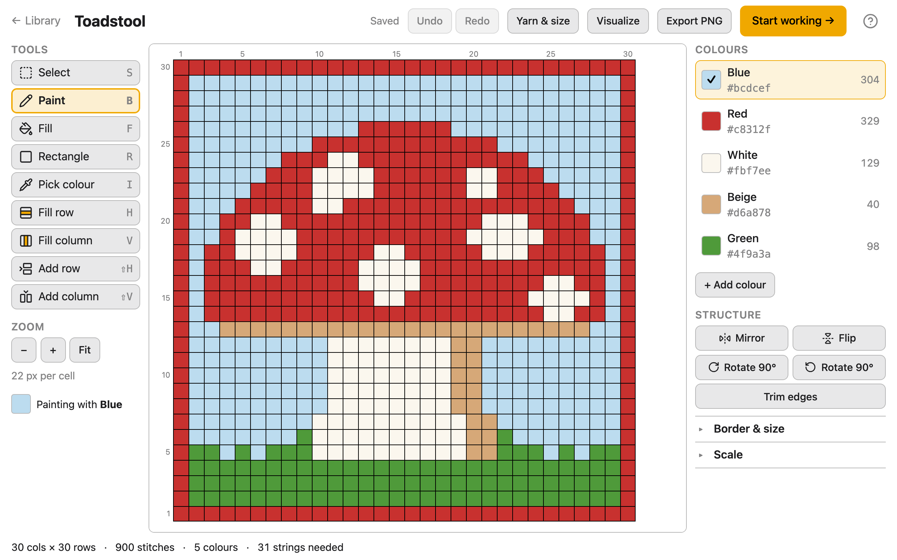
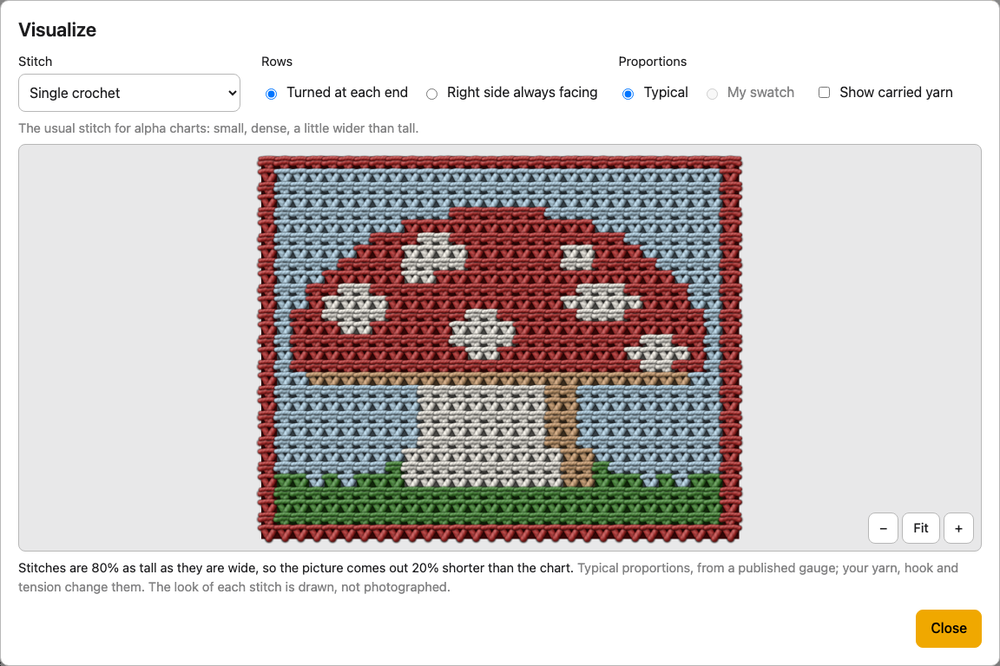
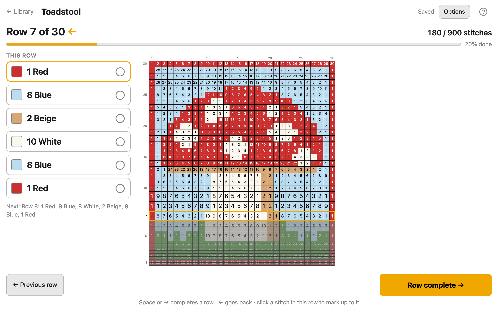
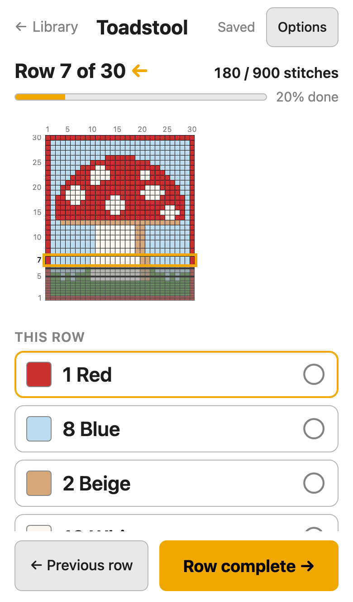

# Alpha Pattern Editor

Turn a photo of a crochet alpha chart into a pattern you can edit and follow row by row.

### [Open the app →](https://alpha-pattern-editor.8b2mbys5sy.workers.dev)

Free, in your browser, no account. Nothing to install.
New to it? Start with the [user guide](docs/guide/index.md).

## Import a chart

Drop, paste or choose a screenshot or photo of an alpha chart. The app finds the grid,
reads every stitch's colour, and names the colours in everyday words. Drag the outline if
it missed a row, merge colours that should be one, and save.

Works best on charts with visible gridlines and even rows, not rotated, with at least
about 6 pixels per stitch. Row and column numbers, watermarks and page margins around the
grid are ignored. Pixel art is read exactly too, a stitch per block.

No chart, just a photo or a drawing? **Photo to pattern** makes a new chart from it: you
choose the width, the detail and the number of colours.

## Design it

Paint, fill, draw rectangles, fill whole rows or columns, add or remove rows and columns.
Rename and recolour colours, add a border, resize to a set size, mirror, flip and rotate,
and undo anything. Or start from a blank grid and draw your own.

Then see how it will look and what it needs:

- **Visualize** draws the pattern as stitches: single crochet, back or front loop only,
  half double, double, waistcoat stitch or C2C, turned at each end or right side always
  facing.
- **Yarn & size** works out the finished size from your swatch, how much yarn each colour
  needs, and matches the colours to real yarn shades.
- **Export PNG** saves the chart as an image.

## Work it, row by row

Made for a phone or tablet next to your hook. Each row is shown as a list of colours and
stitch counts, in the order you work them, with an arrow for the direction. Tap
**Row complete** when you finish one; tick off a colour, or tap a stitch on the chart, to
record part of a row. Your place is
saved as you go. For tapestry crochet, turn on **Show where to carry yarn** in Settings
to see which colours to carry inside the stitches, and for how long.

  
  

## Your projects stay on your device

There's no account and no server: photos and patterns never leave your browser. Projects
are saved in the browser you use, so use **Export** in the Library to keep a copy or to
move a project to another device, and import the `.alpha` file there. Clearing your
browser's data for the site deletes its projects.

The first time you import a photo, the app downloads its chart reader (about 9 MB).
Editing and following patterns need no download.

**Browsers:** tested in Chrome. Safari and Firefox aren't tested yet; if something
doesn't work in yours, please say so.

## Help and feedback

The [user guide](docs/guide/index.md) explains each screen and how to do things in it,
and [Troubleshooting](docs/guide/troubleshooting.md) covers the messages the app shows.

Found a problem or have an idea? [Open an issue](https://github.com/matejmojemeno/alpha-pattern-editor/issues/new),
or use **Feedback** on the app's home screen.

## Credits

- Yarn colours for Stylecraft Special DK, Paintbox Yarns Simply DK and Scheepjes Colour
  Crafter: yarn colorways from [temperature-blanket.com](https://temperature-blanket.com),
  licensed under [CC BY 4.0](https://creativecommons.org/licenses/by/4.0/). Sources and
  changes: [`web/src/yarn/data/README.md`](web/src/yarn/data/README.md).
- Stitch proportions in Visualize come from published gauges, listed in
  [`web/src/stitch/README.md`](web/src/stitch/README.md).

## Developing it

The app is a React and TypeScript site in [`web/`](web/), hosted on Cloudflare. Reading a
chart from a photo runs in the browser too, in Python through Pyodide. Start with
[`web/README.md`](web/README.md) for the commands, and [`docs/README.md`](docs/README.md)
for how it's built and the rules for changing it.
