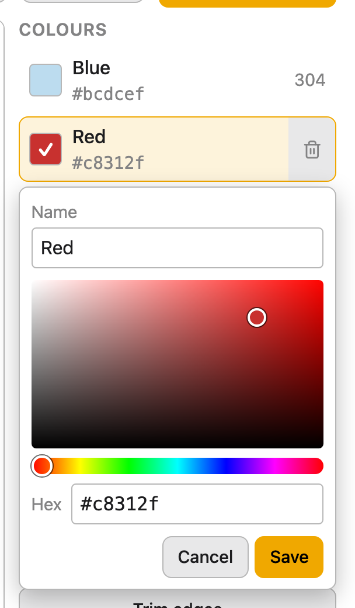
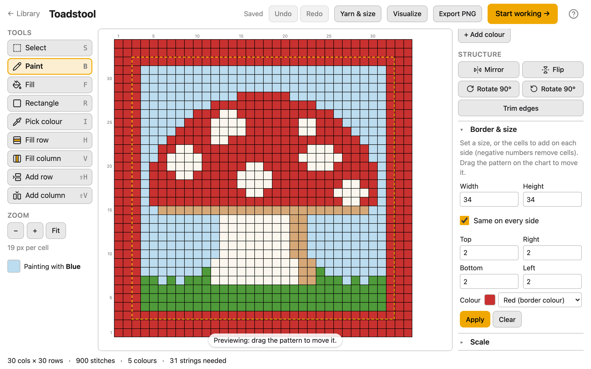

# Designing

The Design stage is where you change a pattern: paint stitches, add and remove rows and
columns, rename and recolour colours, add a border, resize, turn and mirror it. It's also
where you see how it will look in yarn and how much yarn it needs. It opens after an
import, for a blank grid, and whenever you choose **Edit pattern…** while working.

The screen has the **Tools** on the left, the chart in the middle, **Colours** and
**Structure** on the right, and along the bottom the pattern's size, stitches and colours.
Messages about what you just did appear at the bottom right. Every change is saved as you
make it; the top bar says **Saving…**, then **Saved**.

Design is made for a computer or a tablet. On a tablet, the tools are a toolbar over the
chart, and **Colours** and **Structure** open as panels. On a phone, the screen says
**The Design stage needs a larger screen** and offers **Start working →** instead.

## Start from a blank grid

On the home screen, choose **Design pattern** (or **Design pattern…** in the Library).
Give the pattern a name, a number of **Columns** and **Rows** (each 1 to 999), and a
background **Colour**, then press **Create**. The blank grid opens here, ready to paint.
You add the other colours as you go ([Add a colour](#add-a-colour)).

## Paint with the tools

Choose a tool with its button or its key. The colour you paint with is shown under the
tools ("Painting with **Blue**"); choose another in the **Colours** list.

| Tool | Key | What it does |
|---|---|---|
| **Select** | `S` | Select part of the pattern to copy, move or turn it ([below](#copy-move-and-turn-part-of-the-pattern)). |
| **Paint** | `B` | Click a stitch to paint it; drag to paint a line of stitches. |
| **Fill** | `F` | Click a stitch to paint it and every touching stitch of the same colour. |
| **Rectangle** | `R` | Drag from corner to corner to fill a rectangle. `Escape` while dragging cancels it. |
| **Pick colour** | `I` | Click a stitch to paint with its colour. |
| **Fill row** | `H` | Click a stitch to paint its whole row. |
| **Fill column** | `V` | Click a stitch to paint its whole column. |
| **Add row** | `Shift+H` | Add a row where you point ([below](#add-and-delete-rows-and-columns)). |
| **Add column** | `Shift+V` | Add a column where you point. |

On a touch screen, one finger or a pen uses the tool, and two fingers move and zoom the
chart without painting.

## Zoom and move around the chart

Use **−**, **+** and **Fit** under **Zoom**, or the `+` and `-` keys. Hold `Ctrl` (`Cmd` on
a Mac) and scroll over the chart to zoom where you point, or pinch on a touch screen.
**Fit** shows the whole chart again.

The numbers along the chart are the row and column numbers. Rows are numbered in the
order you'll work them: row 1 is the bottom row.

## Add and delete rows and columns

With **Add row** or **Add column**, point at the chart: the new row or column shows where
it will go, in the colour you're painting with. It goes before the row or column you're
pointing at; point past the last one to add one at the end. Click to add it. On a touch
screen, drag it into place and lift your finger; a second finger cancels it.

To delete a row or column, or insert one next to it, press its number on the edge of the
chart. A small menu offers **Insert row above**, **Insert row below** and **Delete row** with its number
(or **Insert column left**, **Insert column right** and **Delete column**). New rows and
columns are in the colour you're painting with.

## Copy, move and turn part of the pattern

Choose **Select** (`S`), then drag over the chart to select a rectangle of stitches. A
click selects one stitch, and a click outside the selection drops it.

- **Move it:** drag inside the selection, or press the arrow keys to move it one stitch at
  a time. Where it was fills with the background colour, the colour most of the pattern's
  edge is.
- **Copy, cut and paste:** **Copy** (`Ctrl+C`), **Cut** (`Ctrl+X`) and **Paste**
  (`Ctrl+V`); on a Mac, `Cmd` in place of `Ctrl`. A paste lands where the selection is (or
  where you copied from), ready to drag into place. You can paste into another pattern
  too: open it in Design and paste. Colours it doesn't have are added. What you copy is
  kept until you reload the page.
- **Turn it:** **Mirror ⇄**, **Flip ⇅**, **Rotate ↻** and **Rotate ↺** turn just the
  selection.
- **Fill with** the colour you're painting with, or **Delete** (the `Delete` or `Backspace` key) to
  empty it to the background colour.
- **Crop to selection** keeps only the selected stitches.
- **Select all** (`Ctrl+A`) and **Deselect** (`Escape`).

While you move, turn or paste, the selection floats over the pattern: drag it past an
edge and back, and it comes back whole. It's put down when you click outside it, press
`Enter`, choose another tool, or make any other change; whatever still hangs over the
edge then is dropped.

## Change a colour or its name

Click a colour in the **Colours** list. It becomes the colour you paint with, and a menu
opens under it with its **Name** and a colour picker: a square for how light and strong
the colour is, a strip for its hue, and a **Hex** field. The chart shows the change as you
make it.

- **Save** (or `Enter`) keeps the change.
- **Cancel** (or `Escape`) drops it.
- Clicking anywhere else also keeps it, and that click does its own job too: click the
  chart to paint with the new colour straight away.

Every change can be undone ([Undo a change](#undo-a-change)).

## Add a colour

Press **+ Add colour**. The same menu opens for a new colour, starting from the colour
you're painting with and named after what it looks like, until you type a name. Choose
the colour and press **Add**.

## Delete a colour

Point at a colour in the list and press its **×** (on a touch screen, it's always shown).
Its stitches take the nearest remaining colour. A pattern always keeps at least one
colour.

## Mirror, flip, rotate or trim the whole pattern

Under **Structure**:

- **Mirror ⇄** swaps left and right.
- **Flip ⇅** swaps top and bottom.
- **Rotate ↻ 90°** and **Rotate ↺ 90°** turn the pattern a quarter turn clockwise or
  anticlockwise, so rows become columns. Press twice for a half turn.
- **Trim edges** removes rows and columns of a single colour from all four edges.

## Add a border, or make it a set size

Open **Border & size** under **Structure**.

- **Width** and **Height** set the finished size in stitches. The extra is shared between
  opposite sides, so the pattern stays centred.
- **Top**, **Right**, **Bottom** and **Left** set how many rows or columns to add on each
  side. Tick **Same on every side** to set all four at once. A negative number removes
  rows or columns from that side.
- **Colour** is the border's colour. It starts as the colour most of the edge already is.

The chart previews the result. Drag the pattern on the preview to move it within the new
size; **Centre the pattern** puts it back in the middle. Press **Apply** to make the
change, or **Clear** to start again. If removing rows or columns would cut into the
design (not just background), the app asks first. Each side can be at most 2000.

## Make the pattern bigger

**Scale**, under **Structure**, turns each stitch into a block of stitches: ×2 makes each
one a 2 × 2 block, up to ×12. It shows the result's size first, and warns you when a side
would be over 999, which is slow to edit and follow. Press **Scale ×2** (or whichever
factor you chose) to apply it.

## Undo a change

**Undo** (`Ctrl+Z`) and **Redo** (`Ctrl+Shift+Z` or `Ctrl+Y`) are in the top bar; on a
Mac, use `Cmd`. Each click, stroke or structure change is one step. Undo goes back up to
50 steps (fewer on a very large pattern), to when you opened the pattern in Design.

## Export the chart as a picture

**Export PNG** saves the chart as an image, named after the pattern: each stitch is a
16-pixel square, with grey gridlines. Use it to print the chart or share it.

## See the size, the yarn and the stitches

- **Yarn & size** works out the finished size and how much yarn of each colour you need:
  see [Yarn & size](yarn-and-size.md).
- **Visualize** draws the pattern as crochet stitches: see [Visualize](visualize.md).

## Go to Work, and what happens to your progress

Press **Start working →** to follow the pattern [row by row](work.md). To come back,
choose **Options** then **Edit pattern…** in Work.

If you've already worked some rows, Design says how many at the top, and keeps your
progress as you edit:

- Painting, adding rows and columns, colours and borders that only add keep every row
  you've marked done.
- If you change the row you're partway through, your place goes back to the start of that
  row.
- Deleting or cropping away rows you've marked done asks first, and that progress goes
  with them.
- **Rotate** and **Scale** give every row a new place, so they ask first, and progress
  starts again from the first row.

**Undo** brings the progress back with the pattern.
