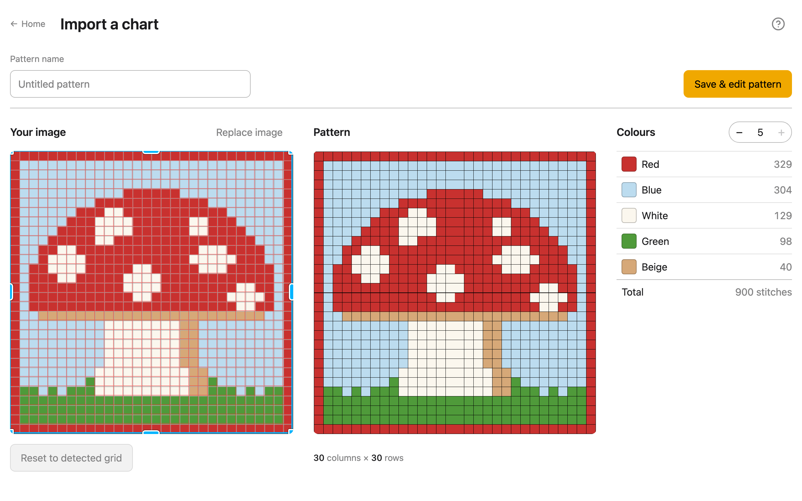
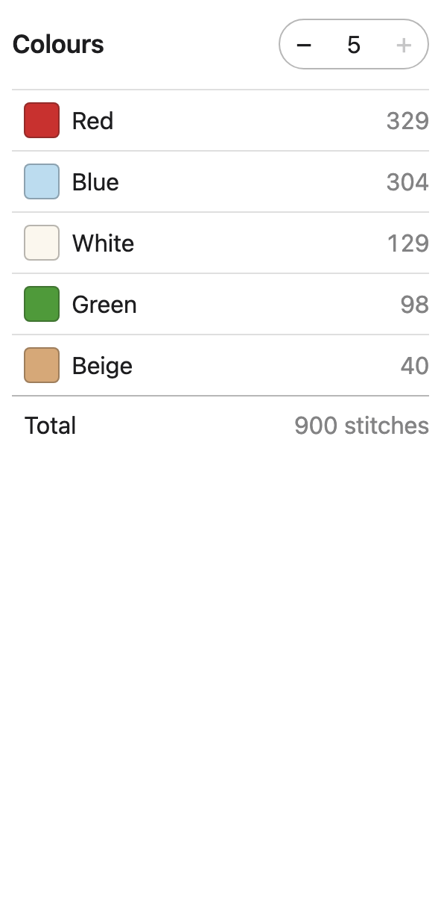

# Importing a chart

**Import a chart** turns a picture of a chart into a pattern. The app finds the grid,
reads each stitch's colour and names the colours; your job here is only to check that the
grid is right, and fix it if it isn't. Changing the pattern itself (painting, removing or
renaming colours) comes next, in [Design](design.md).

Don't have a chart, just a photo or a drawing? Use
[Photo to pattern](#photo-to-pattern) instead: it makes a new chart from any image.

## Choose an image that works

The app reads PNG, JPEG and WebP images: screenshots, saved images, and photos. It reads
a chart best when:

- **the gridlines are visible.** Any colour is fine, lighter or darker than the squares.
- **the rows are even,** every square the same size and lined up, not staggered like
  brickwork.
- **it's straight.** A chart tilted by more than about 1.5° is refused rather than read
  wrongly. Straighten or crop the image first.
- **each square is at least about 6 pixels wide.** A small thumbnail is refused; find a
  larger copy.

Row and column numbers, watermarks, captions and page margins around the grid are fine:
they're left out.

**Pixel art** works too, with or without gridlines: a game sprite or an icon, enlarged or
not. Each block of colour becomes one stitch, exactly, and the screen says "Read as pixel
art". There's no outline to move, since nothing is guessed. (Pixel art saved as JPEG
isn't exact, so it's read as a chart instead.)

Very large photos are shrunk before reading (to about 4 megapixels). The app says so
under the pattern when it does: check the size, and fix it in Design if needed.

## Open an image

From the home screen or the [Library](library.md):

- **drop** the image anywhere on the page;
- **paste** it (`Ctrl+V`, or `Cmd+V` on a Mac), for example straight after taking a
  screenshot;
- or click **Import a chart** (on the home screen) or **Import pattern…** (in the Library)
  and choose the file. On a phone or tablet, tap it.

An image opened this way is always read as a chart: the app never turns it into a
different pattern by itself.

One image is imported at a time. If you drop several, the first opens and the app says
so.

The first import downloads the chart reader, about 9 MB, and shows its progress. After
that it's kept by your browser. Nothing is uploaded: the image is read on your device
([Your data](your-data.md)).

## Read the result

The screen has three parts:

- **Your image**, with the grid the app found drawn over it: red gridlines inside a blue
  outline. Everything outside the outline is dimmed, and won't be part of the pattern.
- **Pattern**, what the image became, with its size underneath, such as
  "30 columns × 30 rows".
- **Colours**, each colour found with its name and how many stitches use it, and the
  total.

Compare the pattern with your image. The most common problems are a row or column missing
at an edge, or two shades that should be one colour. Both are fixed below.

A warning (⚠) above the image means the app is less sure than usual; see
[Troubleshooting](troubleshooting.md#a-warning-shows-above-the-image). "Many squares
were hard to read" means many squares didn't come out as one clear colour: compare the
pattern with your image before you save. If your image is really a photo and not a chart,
**Use Photo to pattern instead** beside it takes the same image there.

## Fix a grid that's a row or column short

The blue outline has a handle on each edge and corner. Drag an edge outwards to take in a
row or column the app left out, or inwards to leave one out. It moves a whole row or
column at a time, and the pattern and its size update as you drag.

With a keyboard, press `Tab` until an edge is focused, then use the arrow keys: each
press moves that edge by one row or column.

## Find the grid again inside a box

If the grid came out wrong, drag a box on the image, anywhere away from the outline's
handles, around just the squares. When you let go, the app looks for the grid again
inside the box only. This also helps when the chart shares the image with other pictures
or a lot of text.

**Reset to detected grid**, under the image, undoes a box and any moved outline, and reads
the whole image again.

## Check where each colour is

Point at a colour in the list: every other colour fades in the pattern, so you can see
where that one is used. Click or tap a colour to keep it showing; click it again to stop.
On a narrower screen, where the colours are below the pattern, **Show all colours** under
the pattern stops it.

The colours get everyday names, such as "Blue" or "Beige". When a chart has two shades
of one colour, they're told apart: "Dark blue" and "Light blue". You can rename any
colour in Design.

## Merge colours that should be one

Photos and blurry screenshots sometimes split one colour into two shades, often an
in-between shade along outlines. The number beside **Colours** shows how many there are:

- **−** merges the two most alike colours: the one used less becomes the one used more.
- **+** undoes the last merge.

Merges are kept when you move the outline or draw a box. To remove a particular colour
instead, save and use its × in [Design](design.md#delete-a-colour).

## Name and save the pattern

Type a name in **Pattern name** at the top, or leave it empty: the pattern is then named
after the date and time you save it. **Replace image**, above your image, starts again
with another image and keeps the name you typed.

Press **Save & edit pattern**. The pattern, and the image you imported, are saved in your
[Library](library.md), and the pattern opens in [Design](design.md).

## When it can't find a grid

If the app can't read the image, it says why in place of the pattern, with what to try.
Each message and its fix is in [Troubleshooting](troubleshooting.md#import-messages).
Most often, a box dragged around just the squares, or a larger, straighter copy of the
chart, gets it read.

If the image isn't a chart at all, **Use Photo to pattern**, under the message, takes it
(and the name you typed) to [Photo to pattern](#photo-to-pattern). Your browser's Back
button returns to reading it as a chart.

## Photo to pattern

**Photo to pattern**, a tile on the home screen, makes a new chart from any photo or
drawing: a pet, a flower, a logo. Unlike importing a chart, nothing is read from the
image square by square. It's redrawn in stitches, and you choose how:

- **Width:** how many stitches across. The rows follow from the image's shape (and from
  your swatch, once it's measured in [Settings](settings.md), which also gives the
  finished size in cm).
- **Detail:** from "Fewer colour changes", which smooths away lone stitches you'd have to
  change yarn for, to "More detail".
- **Keep outlines:** for drawings with dark lines, such as a cartoon. It keeps them, one
  stitch thick. Off to start with; turn it on and see whether it helps.
- **Colours:** the − and + beside the heading make the pattern again with one colour
  fewer or more.

The blue outline crops the image: drag an edge to use only part of it, or drag a box on
the image. **Use the whole picture** undoes it. Then name the pattern and press
**Save & edit pattern**, as for a chart.

Crop close to what you want to see: the background is stitches you'll crochet and never
look at.
