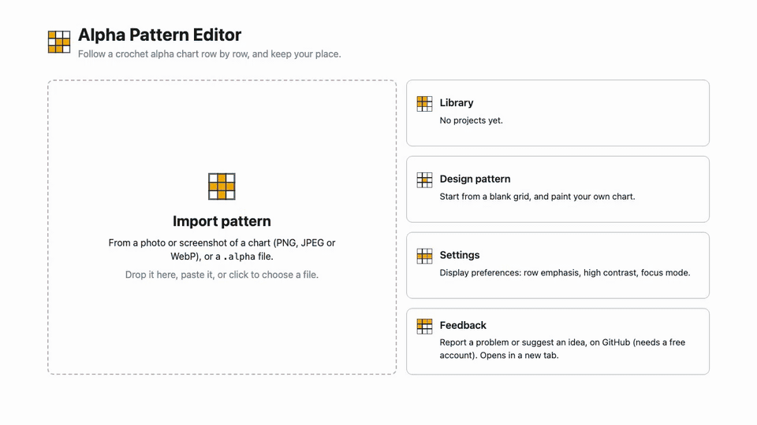
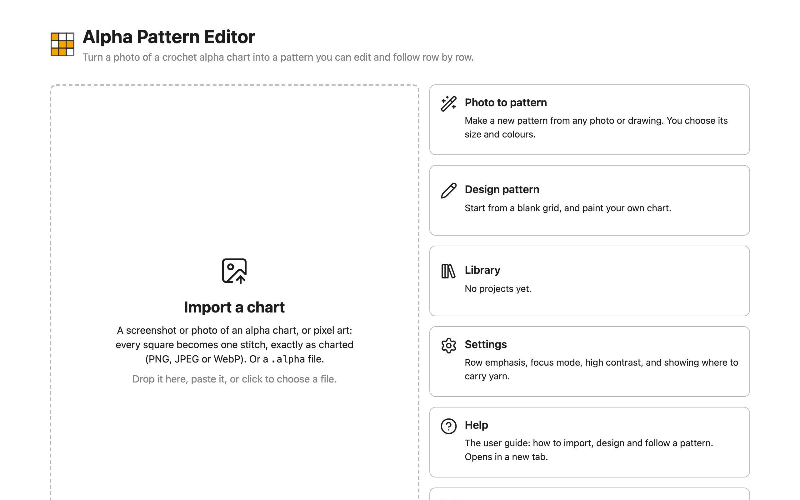

# Getting started

Alpha Pattern Editor turns a photo or screenshot of a crochet alpha chart into a pattern
you can edit and follow row by row. It runs in your browser, is free, and needs no
account: [open the app](https://alpha-pattern-editor.8b2mbys5sy.workers.dev).

The same tour as a [video](media/tour.mp4).

## What an alpha chart is

An alpha chart is a grid of coloured squares. Each square is one stitch, and each row of
squares is one row of crochet. You work the chart row by row, changing colour where the
squares do: in single crochet, tapestry crochet, C2C, or whichever stitch you like.

Charts are usually shared as pictures, so you have to count squares to know what to
crochet. The app reads the picture for you: it finds the grid, reads every stitch's
colour, and then tells you each row as a list, such as "1 Red, 8 Blue, 2 Beige", in the
order you work it.

## The three stages

Every project moves through up to three stages:

| Stage | What it's for | You're here when |
|---|---|---|
| **Import** | Turning a chart image into a pattern, and checking the grid is right. | You've just dropped, pasted or chosen a chart image. |
| **Design** | Changing the pattern: painting, colours, borders, size, and seeing it as yarn. | You've saved an import, started a blank grid, or chosen **Edit in Design** while working. |
| **Work** | Following the pattern row by row, with your place saved. | You've pressed **Start working →**, or opened a project you've already started. |

You can go back and forth between Design and Work as often as you like: **Start working →**
in Design, and **Options** then **Edit in Design** in Work. Everything is saved as you go;
there's no Save button.

The home screen leads to all of it: the big **Import a chart** area, and
**Photo to pattern** (a new chart made from any photo or drawing,
[how](import.md#photo-to-pattern)), **Library**, **Design pattern**, **Settings**,
**Help** and **Feedback** beside it. **Help** opens this
guide, and the **?** at the top of every other screen opens the page about that screen.

## Import your first chart

1. Find a picture of an alpha chart: a screenshot, a saved image, or a photo. Charts with
   visible gridlines, taken straight on, work best (see
   [which images work](import.md#choose-an-image-that-works)).
2. Open the app, and drop the image on the **Import a chart** area, paste it (`Ctrl+V`,
   or `Cmd+V` on a Mac), or click the area to choose the file. On a phone or tablet, tap
   it.
3. The first time, the app downloads its chart reader, about 9 MB. Wait for
   **Finding the grid…** to finish.
4. Check the result: your image with the grid drawn over it on the left, the pattern it
   became in the middle, and its colours on the right. If a row or column is missing,
   [drag the outline](import.md#fix-a-grid-thats-a-row-or-column-short).
5. Type a name in **Pattern name**, or leave it empty to have the date and time as its
   name.
6. Press **Save & edit pattern**. The pattern opens in [Design](design.md).
7. When it looks right, press **Start working →** and follow it
   [row by row](work.md).

You can also start without an image: **Design pattern** on the home screen gives you a
blank grid to paint ([Design from a blank grid](design.md#start-from-a-blank-grid)).

## The rest of this guide

- [Importing a chart](import.md): which images work, and fixing what the app read.
- [Designing](design.md): the tools, colours, borders and size.
- [Following a pattern](work.md): rows, progress, carrying yarn.
- [Yarn & size](yarn-and-size.md): the finished size and how much yarn to buy.
- [Visualize](visualize.md): the pattern drawn as stitches.
- [Library](library.md): your projects, and `.alpha` files.
- [Settings](settings.md): display preferences.
- [Your data](your-data.md): where your projects are kept, and keeping them safe.
- [Troubleshooting](troubleshooting.md): messages the app shows, and what to do.
