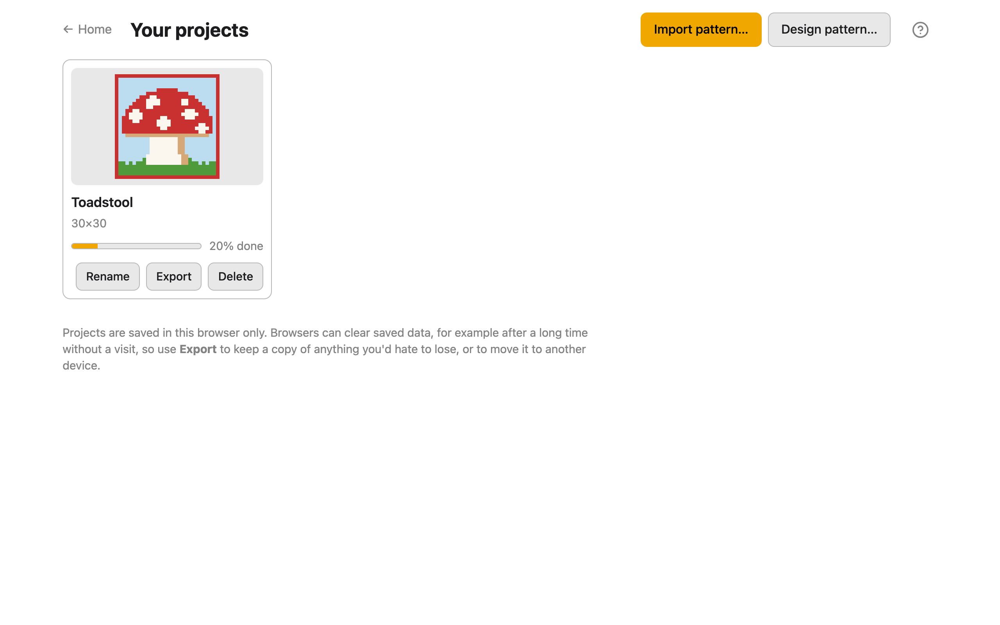

# Library

The Library, **Your projects**, holds every pattern you've imported or designed in this
browser. Open it from **Library** on the home screen, or **← Library** at the top of the
Design and Work stages. Each project shows a small picture of it, its name, its size
in stitches, and a bar for how much of it you've worked.

## Open a project

Click or tap a project's card. It opens in the Work stage if you've worked any of it, and
otherwise where you last had it, Design or Work.

## Rename a project

Press **Rename** under its card, type the new name, then press **Save** (or `Enter`).
**Cancel** (or `Escape`) keeps the old name. You can also rename a pattern from the Work
stage's **Options**.

## Export a project

**Export** under a card saves the project as a `.alpha` file in your downloads. Export a
project to keep a copy, or to move it to another device or browser.

## Delete a project

**Delete** under a card asks first, then removes the project from this browser. It can't
be undone, so export anything you might want again before you delete it.

## What a .alpha file is

A `.alpha` file is one whole project in one file: the pattern, its colours and their
names, your progress in the Work stage, and the chart image you imported, if there was
one. It's the only way to keep a copy of a project outside your browser.

## Back up your projects

Projects are saved in this browser only, and browsers can clear saved data, for example
after a long time without a visit or when you clear your browsing data. Export each
project you care about now and then, and keep the `.alpha` files somewhere safe, such as
a cloud drive. See [Your data](your-data.md).

## Move a project to another device or browser

1. In the Library, press **Export** under the project.
2. Get the `.alpha` file to the other device: email it to yourself, or put it on a cloud
   drive.
3. On the other device, open the app and import the file: drop it on the home screen or
   the Library, or choose it with **Import pattern** (home screen) or
   **Import pattern…** (Library).

Your progress comes with it. You can import several `.alpha` files at once.

## Import a project you already have

A project keeps its identity through export and import. If you import a `.alpha` file of
a project that's already in your Library, the app asks **Already in your library**,
showing how much of each copy is done. **Replace** swaps in the imported copy; **Cancel**
keeps the one you have. This stops an old backup from overwriting newer progress by
mistake.
