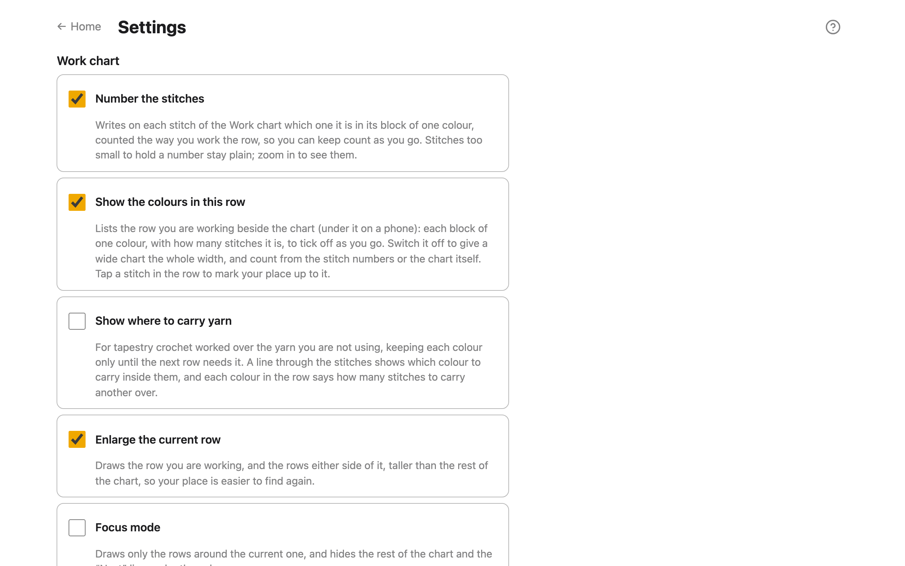

# Settings

Settings are how the Work stage's chart looks, for the whole app. Open them from
**Settings** on the home screen. They're saved in this browser and apply to every
project. All five are also in the Work stage's **Options**, under **Chart**, so you can
change them without leaving your pattern.

## Number the stitches

**Number the stitches** writes on each stitch of the Work chart which one it is in its
block of one colour, counted the way you work the row. It's on to start with. See
[Count stitches on the chart](work.md#count-stitches-on-the-chart).

## Show the colours in this row

**Show the colours in this row** lists the row you're working beside the chart (under it
on a phone): each block of one colour, with how many stitches it is. It's on to start
with. Switch it off to give a wide chart the whole width. See
[Give the chart the whole width](work.md#give-the-chart-the-whole-width).

## Show where to carry yarn

**Show where to carry yarn** is for tapestry crochet, worked over the yarn you're not
using. It shows, on the chart and in each colour of the row, which colour to carry inside
the stitches, and over how many. It's off to start with. See
[Show where to carry yarn](work.md#show-where-to-carry-yarn).

## Make the current row easier to find

- **Enlarge the current row** draws the row you're working, and the rows either side of
  it, taller than the rest of the chart, so your place is easier to find again. It's on
  to start with.
- **Focus mode** draws only the rows around the current one, and hides
  the rest of the chart and the **Next:** line.

## Which corner you start from

This isn't in Settings: it belongs to each pattern. Set it under **How you work it** in
the Work stage's **Options**, with **First stitch** and **Rows**
([which row is row 1](work.md#which-row-is-row-1-and-which-way-it-runs)).

## Find which version you're using

**About**, at the bottom of Settings, gives the app's version and the build it's from.
Mention both when you report a problem. **What's new** lists what changed in each
version.
