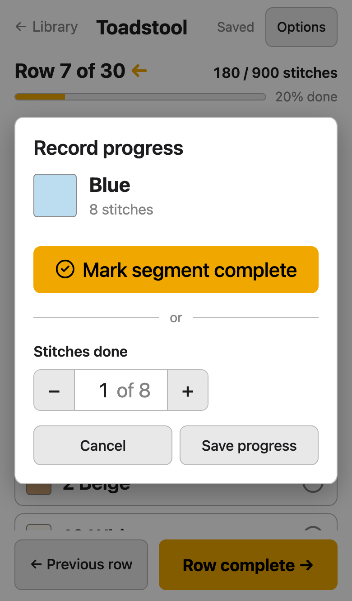
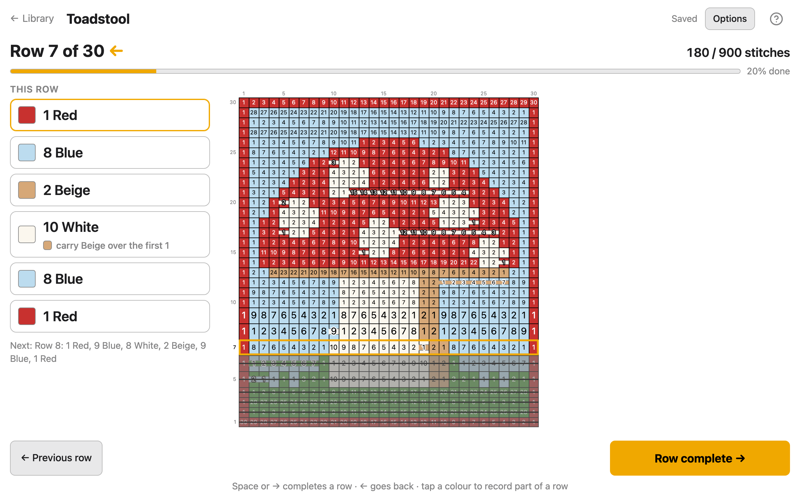

# Following a pattern

The Work stage is for making the pattern: it shows the row you're on as a list of colours
and stitch counts, in the order you work them, and keeps your place. It's made for a phone
or tablet propped up next to your hook or needles, and works just as well on a computer.
Your place is saved as you go; there's no Save button. It follows tapestry crochet unless
you [choose another craft](#choose-your-craft).

  
  

## Read the screen

- **Row 7 of 30 ←** is the row you're on, and the arrow is the way you work it: ← right
  to left, → left to right. Beside it, how many stitches you've done out of the whole
  pattern, and a bar with the percentage.
- **This row** lists the row's colours in the order you work them: "1 Red", then "8 Blue",
  and so on. The colour you're on is outlined.
- **Next:** shows the row after this one, so you can see what's coming.
- The chart shows the whole pattern with the current row outlined and the rows you've
  finished greyed out. Each stitch carries a number: see
  [Count stitches on the chart](#count-stitches-on-the-chart). A pattern more than twice as tall as it is wide fills the width
  and scrolls down with you, keeping your row in the middle. A wide pattern fits the
  screen whole, so you see each row at once without scrolling sideways.

## The Options menu

**Options**, at the top right, has three groups:

- **How you work it:** your craft, the corner you start in, and whether rows go back and
  forth or in the round. These are saved with the pattern.
- **Chart:** how the chart looks, for every pattern: stitch numbers, where to carry yarn,
  an enlarged current row, and **Focus mode**. The same switches are in
  [Settings](settings.md).
- **Pattern:** **Rename…**, **Edit in Design**, **Export PNG** and **Help**.

## Choose your craft

Open **Options** and pick what you're making under **Craft**:

| Craft | Row 1 | Rows |
|---|---|---|
| **Tapestry crochet** | the bottom row, from the right | back and forth |
| **Intarsia crochet** | the bottom row, from the right | back and forth |
| **Stranded knitting (Fair Isle)** | the bottom row, from the right | back and forth |
| **Intarsia knitting** | the bottom row, from the right | back and forth |
| **Alpha friendship bracelet** | the top row, from the left | back and forth |
| **Bead loom** | as the pattern already has it | all the same way |

Picking a craft sets which row is row 1 and which way the rows run, as charts for that
craft are read. The stitch count and **Record progress** say "knots" for a bracelet and
"beads" on a loom. **Show where to carry yarn** is there for tapestry crochet only. The
craft is saved with the pattern.

## Which row is row 1, and which way it runs

Your craft sets these, and you can change them in **Options**, under **How you work it**:

- **First stitch:** the corner of the chart where the pattern begins: **Top left**,
  **Top right**, **Bottom left** or **Bottom right**. Row 1 is the top or bottom row, and
  it runs away from that corner. Crochet and knitting usually start at the bottom right;
  if you work left-handed, pick **Bottom left**.
- **Rows:** **Back and forth** for flat work, where each row runs the opposite way to
  the one before. **In the round** when every round runs the same way. For a bracelet or a
  bead loom it's called **All the same way**.

Underneath, one line says what you've picked in words, for example "Row 1 is the bottom
row of the chart, worked right to left; row 2 comes back left to right."

Each of these is saved with the pattern, and every row's colours and arrow change to
match. If you're partway through a row and it would now read the other way, the app asks
first (**Start row 7 again?**): your place goes back to the start of that row. Rows you've
marked done stay done.

## Finish a row, or go back

- **Row complete →** marks the row done and moves to the next one. When every row is
  done, the screen says **Finished! 🎉**.
- **← Previous row** goes back to the row before, and marks it not done again.

With a keyboard: `Space`, `Enter`, `→` or `↓` complete a row; `←` or `↑` go back one.
Holding a key down doesn't race through rows.

## Stop partway through a row

Each colour in **This row** has a round tick at its right-hand end. Tap it to mark that
colour done in one go. Tap a ticked one again if you ticked it by mistake: your place goes
back to the start of that colour.

Tap the colour itself to record part of it. The **Record progress** dialog opens for that
colour:

- **Mark segment complete** marks that whole colour done.
- Or set **Stitches done** with **−** and **+**, or type it, then press **Save progress**.

You can also tap a stitch of the current row on the chart (the outlined row): that stitch
and every one before it count as done. Taps on other rows do nothing, and neither does a
tap that stops the chart scrolling, so you can't lose your place by brushing the screen.

The colours before the one you mark count as done too. Finishing the last colour
finishes the row. The chart shows how far along the row you are, and your place is kept
until you come back.

When a row has more colours than fit on the screen, the list scrolls by itself: the colour
you're on moves to the top, so the next ones are in view, and a new row starts at the top
of the list again.

## Show where to carry yarn

For tapestry crochet, where the colours you aren't using are carried inside the stitches
rather than left hanging at the back, turn on **Show where to carry yarn** in **Options**
(or in [Settings](settings.md)). It's only there when the craft is **Tapestry crochet**.

Each colour is kept only until the next row needs it, so you never carry more than you
must. On the chart, a line of a colour through a run of stitches means: carry that colour
inside those stitches. With [stitch numbers](#count-stitches-on-the-chart) on, the line
runs along the bottom of each stitch, under its number. In **This row**, a colour's chip
says what to do while you work it, such as "carry Beige over the first 1", or "pick up
Black, carry over the last 3".

A line is drawn only where carrying starts and stops partway through a row, where you
need to count. Where a colour is carried on to the end of the row, a short arrow of that
colour points on from just after its last stitch, and the chip says "carry Black on to
the end of the row". Where a colour is carried from the start of the row up to its first
stitch, the arrow is in the row's first stitch, and the chip says "carry Black from the
start of the row".

When you work in rounds, the end of one round runs straight into the start of the next.
A colour the next round needs before the place where you left it is carried on round
that join: over the rest of this round, then over the first stitches of the next, up to
where it's needed. On some patterns that means carrying a colour almost all the time.
On the chart that's an arrow at the end of one round and another at the start of the
next, and the chips say "carry Black on to the end of the round" and "carry Black from
the start of the round".

## Count stitches on the chart

Each stitch on the chart has a number: which one it is in its block of one colour,
counted the way you work the row. In a row worked right to left that reads "1 Red, 8
Blue…", the red stitch at the right is 1, and the blue ones next to it are 1 to 8, from
right to left. The count starts again at 1 with each new block, so a glance at the chart
tells you how far into a block you are.

Stitches too small to hold a number stay plain: a big pattern on a phone may show
numbers only on the taller rows around your place, or none until you zoom in. To hide
the numbers, switch off **Number the stitches** in **Options** (or in
[Settings](settings.md)).

## Zoom and scroll on a phone

Scroll the chart with one finger. Pinch with two fingers to zoom in or out; on a
computer, hold `Ctrl` (`Cmd` on a Mac) and scroll. Once you finish a row or record
progress, the chart moves back to your place. The zoom goes back to normal each time you
open the Work stage.

To see more of the rows near your place, or only those, see
[Enlarge the current row, or hide the rest](settings.md#make-the-current-row-easier-to-find).

## Keep the screen awake

While the Work stage is open, the app asks your device to keep the screen on, so it
doesn't go dark mid-row. Some browsers don't allow this, for example in a battery-saving
mode; then the screen sleeps as usual, and your place is still saved.

## Get help

The **?** at the top of the screen opens this page. On a phone there isn't room for it,
so it's **Options** then **Help**.

## Rename the pattern

Open **Options** and choose **Rename…**. Type the new name, then press `Enter` to keep it
or `Escape` to leave it as it was.

## Save the chart as a picture

**Options** then **Export PNG** saves the chart as an image named after the pattern, to
print, share or keep with your yarn. It shows what you have switched on under **Chart**:
the stitch numbers, and where to carry yarn. It has the row numbers in working order
down the side and the column numbers along the top.

It doesn't show your progress: no outline on the current row, no greyed-out finished
rows, and no enlarged rows, and **Focus mode** doesn't hide any of the chart. It's drawn
on a white background even when your device is in dark mode. A very large pattern is
drawn with smaller squares, so the file isn't too big for the browser to save.

**Export PNG** in [Design](design.md) saves the plain chart, with no numbers.

## Change the pattern

**Options** then **Edit in Design** opens the pattern in [Design](design.md). Your progress
comes with it; the Design page says
[what happens to it when you edit](design.md#go-to-work-and-what-happens-to-your-progress).
