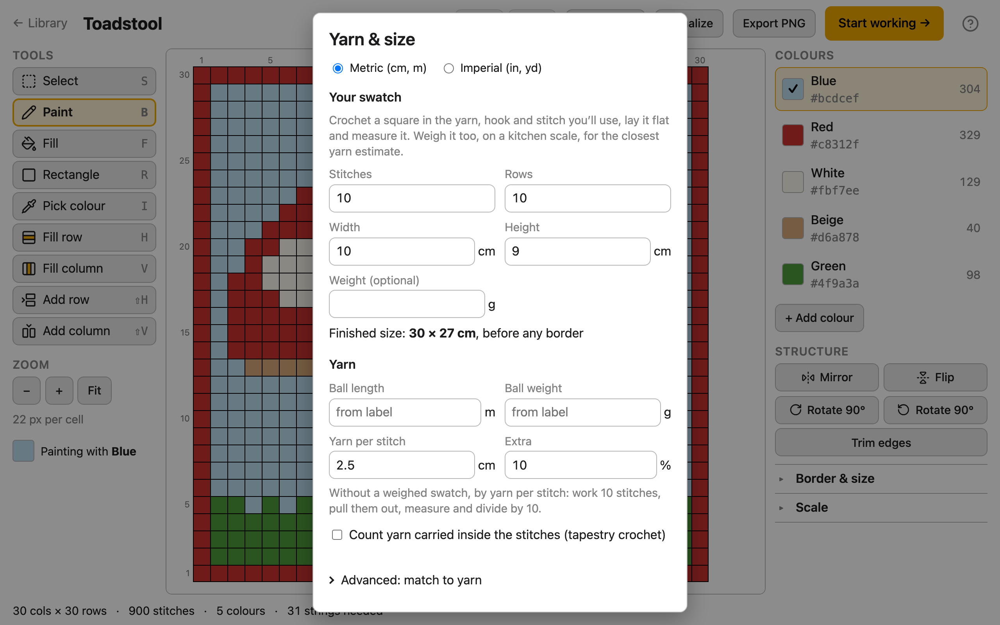

# Yarn & size

**Yarn & size**, in the Design stage's top bar, tells you how big the finished piece will
be and how much yarn of each colour to buy, for the pattern as it stands. It works from a
swatch you crochet in your own yarn, hook and stitch, because those change both far more
than any chart can guess.

What you enter here is kept in this browser for every pattern, because it describes your
yarn and your hands, not the chart. Choose **Metric (cm, m)** or **Imperial (in, yd)** at
the top.

## Measure a swatch

1. Crochet a small square in the yarn, hook and stitch you'll use for the pattern: 10
   stitches by 10 rows is a good size.
2. Lay it flat and measure its width and height.
3. Optionally, weigh it on a kitchen scale.

Under **Your swatch**, enter its **Stitches** and **Rows**, its **Width** and **Height**,
and its **Weight (optional)**.

## See the finished size

Once the swatch's width and height are in, the dialog shows **Finished size**: the
pattern's columns and rows at your swatch's stitch width and row height. It's the size
before any border you crochet round it afterwards.

## Work out how much yarn you need

The table lists each colour with its stitches and, once there's enough to go on, how many
metres (or yards), grams and balls it needs. The dialog works it out in one of two ways:

- **By weight,** when you've weighed your swatch: each stitch weighs the swatch's weight
  divided by its stitches. This is the closer estimate.
- **By length,** when you haven't: from **Yarn per stitch**, 2.5 cm unless you change it.
  To measure your own, work 10 stitches, pull them out, measure the yarn and divide by 10.

Under **Yarn**, enter the **Ball length** and **Ball weight** from the ball's label, to
convert between metres and grams and count balls. **Extra** adds a margin, 10% unless you
change it, for ends, a foundation chain and borders, which aren't counted otherwise. The
figures are rounded up.

**Export yarn list** saves the table as a text file named after the pattern, to take
shopping.

## Count carried yarn

In tapestry crochet, the colours you aren't using are carried inside the stitches, which
uses more of them. Tick **Count yarn carried inside the stitches (tapestry crochet)** to
add it. The app counts where each colour is carried the same way the Work stage's
[carrying hints](work.md#show-where-to-carry-yarn) show it, and each carried stitch as
about one stitch's width of yarn. It needs your swatch's width, and, by weight, the ball's
length and weight too; the dialog says what's missing.

## Match colours to a yarn range

Open **Advanced: match to yarn** and choose a range in **Match colours to**:

- Stylecraft Special DK
- Paintbox Yarns Simply DK
- Scheepjes Colour Crafter
- DMC stranded cotton

Each colour in the table then shows the nearest shade in that range, and the exported yarn
list names it. For the three yarns, the ball's length and weight fill in from the range
(you can still type your own). Choose **Nothing** to turn matching off.

The match is by colour on screen, and a picture of a chart is never exactly the yarn:
screens differ, and dye lots vary. Look at the real yarn before you buy.

### Where the colours come from

The shade colours for Stylecraft Special DK, Paintbox Yarns Simply DK and Scheepjes Colour
Crafter are the yarn colorways from [temperature-blanket.com](https://temperature-blanket.com),
licensed under [CC BY 4.0](https://creativecommons.org/licenses/by/4.0/). Scheepjes shade
numbers come from scheepjes.com, and the ball sizes from the makers' and sellers' pages.
The full sources, and what was changed, are in
[the yarn data's notes](../../web/src/yarn/data/README.md).
